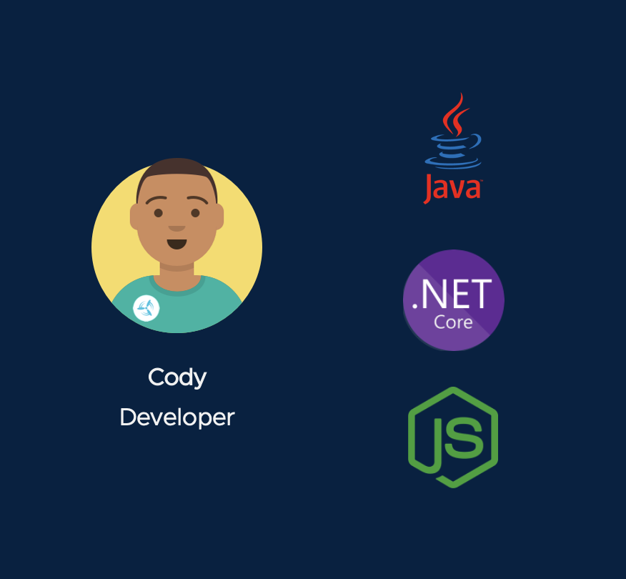

We're going to start our story with Cody. He's a developer who is an absolute star in writing business applications using popular languages and frameworks, but he's not a deep expert on container infrastructure.

Cody's most recent project is to build an application for a local Pet Clinic to help keep track of pets, their owners, and the veternians in the clinic.  ]He has developed the initial release of a [Spring Boot](https://spring.io/guides/gs/spring-boot) application using [Maven](https://spring.io/guides/gs/maven/) named "Spring Pet Clinic."  He is using Github as his source control, and since the application has passed testing, a `1.0.0` version has been created and is ready for deployment to Kubernetes.  

Feel free to take a look at the [source code and documentation](https://github.com/ryan-a-baker/spring-petclinic/tree/1.0.0) for the application on GitHub, but no specific action is needed.