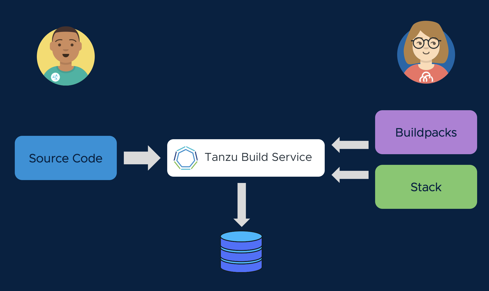

Cody is using the best frameworks and practices in developing his application code, but now he needs to package that code up for delivery so that it can be run.  However, Cody isn't always current on best practices for designing, securing, and optimizing the performance of containers, and patching/updating container dependencies is a chore.

Fortunately, Cody has a partner in crime named Alana. She is the DevOps guru who operates the company's Kubernetes clusters, and she's got a plan for automating the container build process so that it happens the right way, every time.


Alana's secret weapon is Tanzu Build Service (TBS). TBS enables a clear separation of roles, where developers like Cody supply the source code that will be used in the application container image, but operators like Alana specify container design templates. Alana uses Cloud Native Buildpacks supplied by VMware. **Buildpacks** produce container images for a broad range of language runtimes, and they have been optimized for security performance. These buildpacks are updated several times a month by VMware, to include the latest application runtime dependencies and security fixes. Alana also selects a **stack** (a base OS image for the container) from VMware. VMware stacks are also rapidly updated, providing protection from the latest CVEs.



Let's see how this works. With Tanzu Build Service, we will create an **image**. This is a mapping of Cody's source repo (or the application artifact produced by Cody's CI pipeline) to a container image in our Docker registry. Remember that the artifact Cody does not have to contain a dockerfile.  The Tanzu build service will analyze the source code against the available build packs, and build the layers of the image using years of community best practice standards from the build packs that match Cody's source code.

When you create an image with TBS, you have a few options one where the source code can be referenced:

1.  A Git repository such as GitHub, GitLab, Azure Repos, etc.
1.  An blob storage such as S3 if a CI pipeline (or other means) is building the artifact
1.  Local file system, in the event that your artificat is produced locally.

Since a 1.0.0 version of our application has already been created in the GitHub repoistory, we'll start our image build with that version.  If we wanted to 

```terminal:execute
command: kp image create spring-webdb -c demo-cluster-builder --tag harbor.{{ ingress_domain }}/{{ session_namespace }}/spring-webdb --local-path ~/spring-webdb.jar
session: 1
```

A **build** will be triggered when an image is created, or when the application's source code is updated. Use this command to stream the build logs as you describe the buildpack process.

```terminal:execute
command: kp build logs spring-webdb
session: 1
```

Tanzu Build Service recognizes Cody's source code as Java, and employs a Java Buildpack to create a container image that runs the application. The container image will include VMware's best practices for container design, and the latest dependencies. Cody does not need to be a containerization expert to produce a secure, performant image.

Tanzu Build Service is an important tool for Day 2 Operations as well. Alana can update the buildpacks, or the stacks, and TBS will automatically trigger a rebuild of all affected containers in her environment. This means Alana doesn't have to work through Cody to keep her container runtimes patched and secure.

Surprise! In the previous command, we actually told Tanzu Build Service to run that build with an outdated OS image, riddled with security vulnerabilities. Let's see what happens when our Alana tells Tanzu Build Service to use publishes a new stack (base image), triggering a rebuild of the affected container without getting Cody involved:

```terminal:execute
command: kp image patch spring-webdb --cluster-builder default
session: 1
```

See how the image is quickly rebuilt:

```terminal:execute
command: kp build logs spring-webdb
session: 1
```

And check out the build history of the image. The first build was triggered when we defined the image, the second when we provided a new base OS layer:

```terminal:execute
command: kp build list spring-webdb
session: 1
```
