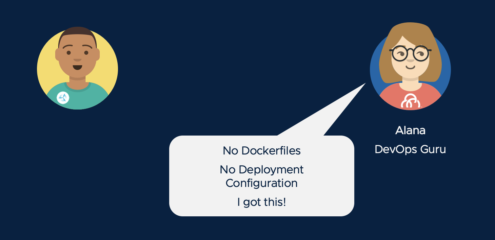
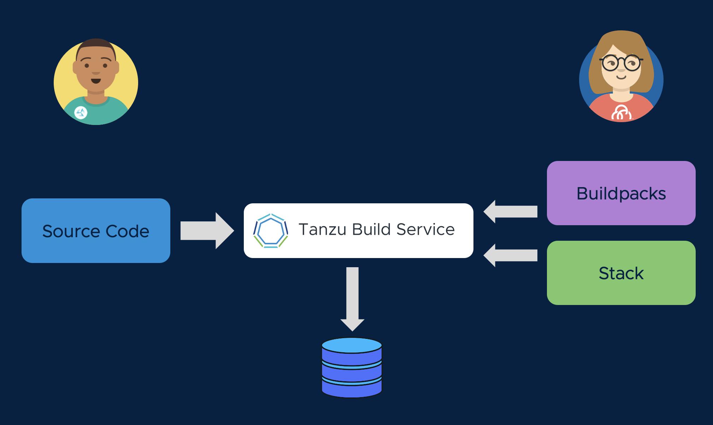

Cody is using the best frameworks and practices in developing his application code, but now he needs to package that code up for delivery so that it can be run.  However, Cody isn't always current on best practices for designing, securing, and optimizing the performance of containers, and patching/updating container dependencies is a chore.

Fortunately, Cody has a partner in crime named Alana. She is the DevOps guru who operates the company's Kubernetes clusters, and she's got a plan for automating the container build process so that it happens the right way, every time.



Alana's secret weapon is Tanzu Build Service (TBS). TBS enables a clear separation of roles, where developers like Cody supply the source code that will be used in the application container image, but operators like Alana specify container design templates. Alana uses Cloud Native Buildpacks supplied by VMware. **Buildpacks** produce container images for a broad range of language runtimes, and they have been optimized for security performance. These buildpacks are updated several times a month by VMware, to include the latest application runtime dependencies and security fixes. Alana also selects a **stack** (a base OS image for the container) from VMware. VMware stacks are also rapidly updated, providing protection from the latest CVEs.



Let's see how this works. With Tanzu Build Service, we will create an **image**. This is a mapping of Cody's source repo (or the application artifact produced by Cody's CI pipeline) to a container image in our Docker registry. Remember that the artifact Cody does not have to contain a dockerfile.  The Tanzu build service will analyze the source code against the available build packs, and build the layers of the image using years of community best practice standards from the build packs that match Cody's source code.

When you create an image with TBS, you have a few options on where the source code can be referenced:

1.  A Git repository such as GitHub, GitLab, Azure Repos, etc.
1.  A blob storage such as S3 if a CI pipeline (or other means) is building the artifact
1.  Local file system, in the event that your artificat is produced locally

As perviously discussed, Cody is storying the source code for the Spring Pet Clinic on [Github](https://github.com/ryan-a-baker/spring-petclinic/tree/1.0.), and a `1.0.0` version has already been created.  When using a Git Repo such as GitHub, TBS has a few options on how to reference the code we want to build.

1.  A branch, such as "main".  When using a branch as your source, any commit to that branch will automatically trigger a new image build once TBS detects the new commit.
2.  A speficic commit SHA.  This is what VMware typically recommends when using [TBS in a CI/CD pipeline](https://docs.pivotal.io/build-service/1-2/tbs-in-ci.html).  When ready to build a new image, the `kp image patch` or `kp image save` command can be used to update to the desired SHA.
3.  A tag, such as the `1.0.0` version that we're going to use in this workshop.

In order to keep the external dependencies simple and prevent the requirement of a GitHub account for this workshop, we're going to use the `1.0.0` tag that was already created for the Spring Pet Clinic.  

```terminal:execute
command: kp image create spring-petclinic -c demo-cluster-builder --tag harbor-demo.{{ ingress_domain }}/{{ session_namespace }}/spring-petclinic --git https://github.com/ryan-a-baker/spring-petclinic.git --git-revision 1.0.0
session: 1
```

Next, we'll look at the logs of the build and understand the different phases.