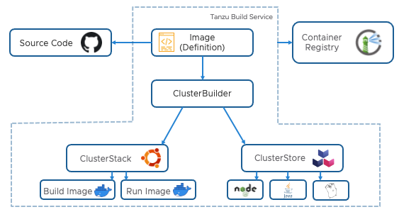

Welcome to the overview on the Tanzu Build Service! In this workshop, we'll explore how the Tanzu Build Service can produce OCI Compliant container images from source code in a repeatable, scalable, and secure manner.  

We're going to take a sample application, use the Tanzu Build Service to build a container, deploy it, update the application, and finally, patch the base operating system.

In the process of the workshop, we'll use Harbor to look at the container image that Harbor produced.  

Prior to starting the workshop, use the following link to sign into the Harbor Web UI with the username "admin" and password "Harbor12345" {{ ENV_HARBOR_PASSWORD }}.

```dashboard:create-dashboard
name: Harbor
url: https://harbor.{{ ingress_domain }}/harbor/projects/{{ harbor_project_id }}/repositories
```

The Tanzu build service has several resources that will be discussed during this workshop that work together to produce container images.  Before getting started, it may help to review the diagram and terms of these resources for background information.



**Image**: Defines the source of the application, build time environment and registry destination. This source code could reside in git, a blobstore, or as code on a workstation.

**BuildPack**: Provide framework and runtime support for apps. Buildpacks typically examine your apps to determine what dependencies to download and how to configure the apps to communicate with bound services

**ClusterBuilder**: References the Stack and Buildpacks that are used in the process of building source code. They “provide” the Buildpacks that run against the application and the OS images upon which the application is built and run.

**ClusterStore**: ClusterStore serves as a repository for Cloud Native Buildpacks available for use in Builders. One can populate a store with Buildpacks they create and package.

**ClusterStack**: A ClusterStack defines a pair of build and run OS images. Critical security vulnerabilities are addressed by building apps on the most up-to date stack. The stacks used by Build Service to build applications are referenced in the Builders.
